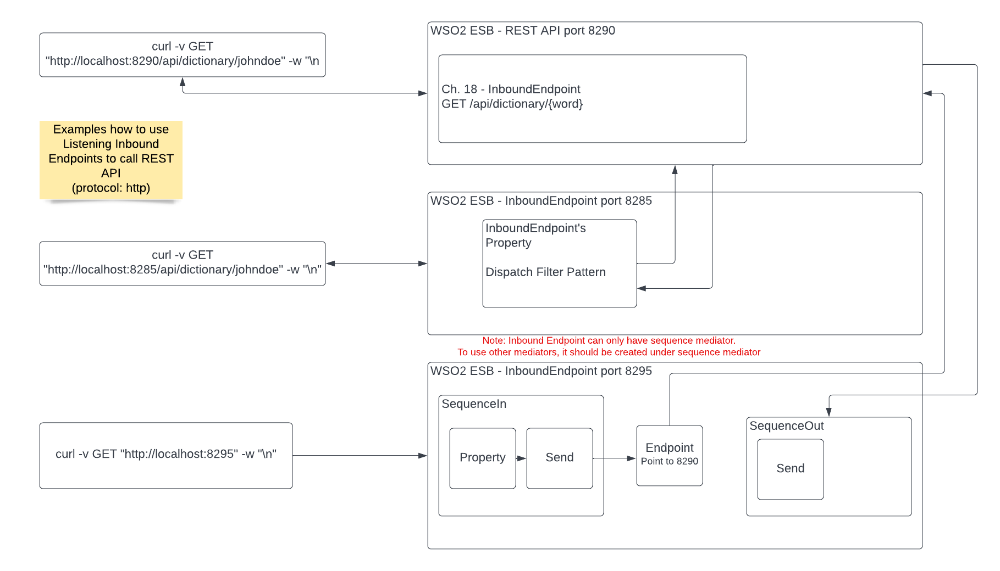
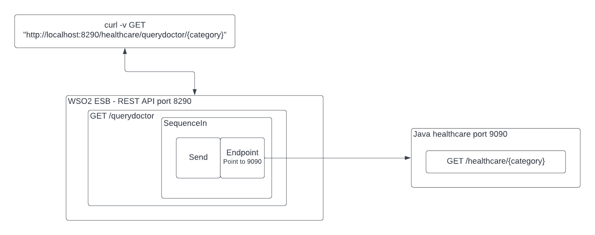
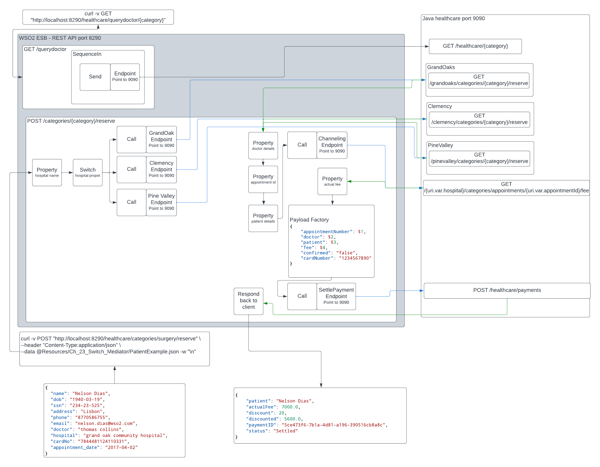

# [Udemy - Learn WSO2 MI: a Step Guide to Master ESB & API Integration](https://www.udemy.com/course/learn-wso2-mi-a-step-guide-to-master-esb-api-integration/)
Instructor: Nelson Dias

Github: https://github.com/nelsonandredias/wso2_course


## Tools
 * [WSO Integration Studio](https://wso2.com/integration/integration-studio/)

## Deploying code

To pull this code and save it in default workspace (using WSO2 IS v8.0.0)
```bash
	cd ~/IntegrationStudio/8.0.0/workspace
	git clone https://github.com/wwangsa/learnWSO2.git
```

## Tips
* When doing google search, use the following keywords. Most of the time, google search will point to old article so specifying version would help narrow down the latest result. WSO2 Enterprise Integrator (EI) was introduced on v6.
	* ESB: WSO2 EI ESB {version}
	* Data service server: WSO2 EI DSS {version}
* When dragging and drop mediators, sometimes the mediators keep dragging the previous mediator. This is the IDE bug. You have to click the new mediator until it got highlighted (may have to click multiple times), then you drag it.
* To stop the console run, there is a maximize icon on top right of the console window. When it's click, you will see the stop button
* On WSO2 integration studio, to deselect project on Project Explorer, use ctrl+shift+click on the folder that is currently selected. If a folder is selected in the Project Explorer window, it will create new integration project underneath that folder.

## References
* To learn more different types of core mediators and what it could do, here is the [link to the v 7.2.0](https://ei.docs.wso2.com/en/7.2.0/micro-integrator/references/mediators/about-mediators/#!) with Micro Integrator.
* This [6.4.0 documentation](https://docs.wso2.com/display/EI640/ESB+Mediators) has core mediators' description summarized as a table

## Section 1: Introduction


6. Create the project Zero (Project folder: ProjectZero)
	* When creating new integration project, use the "New Integration Project". This will create a folder that contains with *ESBConfigs* and *CompositeExporter* folders undeneath it.
	* To add REST API Project, click on the *ESBConfigs* folder > New> REST API > Create A New API Artifact

	Create an endpoint where name is passed as path param and it will return a greeting message "Welcome {name}".


	Call GET greetings/{name}
	```bash
		curl -v GET "http://localhost:8290/greetings/Nelson" -w "\n"
	```
	
	Note on Mediators:
	1. API: Where the it defines the part of url. In the ex above, ie. greetings
	2. Resource: Where the endpoints path are defined. In the ex above, ie. name
	3. Log: To generate message in the log file
	4. Property: It is used to manipulate messages. A formula can be used to concatenate the values from query strings or path params
	5. Payload Factory: Transforms or replaces the contents of a message in other words set how the output looks like based on message created by property
	6. Inflow and Outflow Mediators: inflow refers to request sequence while outflow refers to response sequence. Each sequence has childs in it such as log, property, payload factory and so on.
	7. To run the project, right click on the "ProjectZeroCompositeExporter" and "Export Projects Artifact and Run"
	

## Section 2: Message entry points

12. Intro
	```bash
		curl -v GET "http://localhost:8290/" -w "\n"
	```
	When no resource specified, the curl will return 404 while the log mediator will report "main sequence executed for call to non-existent". This message comes can be customizedfrom
	{IntegrationStudio_Home}/runtime/microesb/repository/deployment/server/synapse-configs/default/sequences/main.xml and add the following underneath the first custom log

	```xml
	<log descripton="LOG CUSTOM MAIN SEQUENCE" level="custom">
            <property name="LOG CUSTOM DEFAULT MESSAGE" value="this messages is part of the default main sequence"/>
    </log>

	```
	With the changes above, when we run the curl without resource specified, we will get 405 Methods not allowed when doing curl. While the logmediator will report the xml message above.

13. REST APIs - Default API Resource (Project folder: ECommerceAPI)

	Using Log mediator to generate log message.

	```bash
		# GET orders
		curl -v GET "http://localhost:8290/orders" -w "\n"
	```

	```log
	# On Micro Integrator Server Log, it generates the following line when the curl is executed
	2022-02-09 23:36:51,656]  INFO {LogMediator} - {api:EcommerceAPI} LOG MESSAGE = this is the default resource
	```

14. REST APIs - URI Template

	Resource's URL Style: URI_TEMPLATE
	
	Allowing path on the resource url

	Message flows: 
	1. On the new API Resource, define the URI_TEMPLATE so we can use the path params (`$ctx:uri.var.currentMonth`) and query strings (`$ctx:query.param.minday` and `$ctx:query.param.maxday`). 
	2. Log Message is used to log and capture the path params and query strings then hold them into variables.
	3. Set Payload is used to define the message output based on variables passed onto the output
	4. Loop Back mediator is used to move the message from inflow (request path) to outflow (response path) sequence.  All the configuration included in the in sequence that appears after the Loopback mediator is skipped.
	5. Respond mediator is used to send back the result back to the client

	Call `GET orders/month/{currentMonth}`
	```bash
		#Before adding the query strings in the log message
		curl -v GET "http://localhost:8290/orders/month/January" -w "\n"
	```
	Result `GET orders/month/{currentMonth}`
	```json
		{
        	"month":January
		}
	```
	Call `GET orders/month/{currentMonth}?*`
	```bash
		#After adding the query strings in the log message
		curl -v GET "http://localhost:8290/orders/month/January?minday=1&maxday=20" -w "\n"
	```
	Result `GET orders/month/{currentMonth}?*`
	```json
		{
			"month":January,
			"minday":1,
			"max":20,
			"totalOrders": 200
		}
	```

15. REST APIs - URL Mapping
	
	Resource's URL style - URI_MAPPING
	
	Request that match the mapping pattern will be processed. There are 3 kinds of url mapping:
	* Extension mapping. Ex: `/.jsp`
	* Exact mapping. Ex: `/test` 
	* Path mapping. Ex: `/test/*`
	
	Be careful when constructing JSON. Missing double quote will compiled ok but would not show result

	Call `GET orders/list`
	```bash
		#After adding the query strings in the log message
		curl -v GET "http://localhost:8290/orders/list" -w "\n"
	```
	Result `GET orders/month/{currentMonth}?*`
	```json
		{
			"orders":{
				"order":{
					"country":"Portugal",
					"total":394
				},
				"order":{
					"country":"Spain",
					"total":212
				},
				"order":{
					"country":"Brazil",
					"total":690
				}
			}
		}
	```

16. REST APIs - Swagger files (Project folder: SwaggerFile)
	
	* After the project is created and project artifacts exported, the Swagger Editor tab will shows up next to Design and Source tabs for the xml file you edit. This is due to built in Swagger processor in WSO2. 
	* The processors setting can be found in {Integration_Home}/runtime/microesb/conf/carbon.xml. 
	* To access the project's swagger, go to either urls: 
		* http://localhost:8290/PetsAPI?swagger.json 
		* http://localhost:8290/PetsAPI?swagger.yaml (download)
	* We can download the yaml file and upload it to the Postman so we don't have to set it up in Postman manually. One thing to note that Postman will use https url.

	Below is to test manually using curl
	Call `GET api/pets`
	```bash
		#After adding the query strings in the log message
		curl -v GET "http://localhost:8290/api/pets" -w "\n"
	```
	Result `GET api/pets`
	```json
		{
			"pet":{
				"name":"Kuky",
				"animal":"Dog"
			},
			"pet":{
				"name":"Kuky",
				"animal":"Cat"
			},
			"pet":{
				"name":"Star",
				"animal":"Cat"
			},
			"pet":{
				"name":"Gems",
				"animal":"Mouse"
			}
		}
	```

	Call `GET api/pets/{name}`
	```bash
		#After adding the query strings in the log message
		curl -v GET "http://localhost:8290/api/pets/Kuky" -w "\n"
	```
	Result `GET api/pets{name}`
	```json
		{
			"pet":{
				"name":"Kuky",
				"animal":"Dog"
			},
			"pet":{
				"name":"Kuky",
				"animal":"Cat"
			}
		}
	```

17. Proxy services (Project folder: ProxyService)

	The instructor use a SOAP service for the Proxy services example. The proxy services used to perform transformation and introduce functionality without changing the existing service. He provided 2 files:
	1. Java based SOAP service. The webservice can be accessed at http://localhost:9000/services/SimpleStockQuoteService

	```bash
		#Prerequisites. The instructor uses Java 1.8 or Java 8 (OpenJDK). It would not work with 11 or higher. Run the following to install java 8.
		sudo apt install openjdk-8-jdk
		#create symbolic link so we can execute it by calling java8
		sudo ln -s /usr/lib/jvm/java-8-openjdk-amd64/bin/java /usr/bin/java8

		#To run the web services, execute this with java 8.   
		java8 -jar Resources/Chapter_17_Proxy_Services/stockquote_service.jar
	```	
	2. Import WSDL file using Postman, SoapUI or Curl

		The instructor is using SoapUI. Below is the instruction to use Postman or curl

		a. Under Postman's colection, expand SimpleStockQuoteService > SimpleStockQuoteServiceHttpSoap12Endpoint/getQuote then go to the Body and change the value under the symbol tag to `IBM`. 


		b. Using Curl
		* Using xml file as data reference. Due to relative path, make sure to run it on the workspace folder.
		```bash
			curl --location --request POST 'http://localhost:9000/services/SimpleStockQuoteService' \
			--header 'Content-Type: text/xml; charset=utf-8' \
			--header 'SOAPAction: urn:getQuote' \
			--data @Resources/Ch_17_Proxy_Services/requestBody.xml
		```
		* Without using xml file
		```bash
			curl --location --request POST 'http://localhost:9000/services/SimpleStockQuoteService' \
			--header 'Content-Type: text/xml; charset=utf-8' \
			--header 'SOAPAction: urn:getQuote' \
			--data-raw '<?xml version="1.0" encoding="utf-8"?>
			<soap:Envelope xmlns:soap="http://schemas.xmlsoap.org/soap/envelope/">
			<soap:Body>
				<getQuote xmlns="http://services.samples">
				<request>
					<symbol>string</symbol>
				</request>
				</getQuote>
			</soap:Body>
			</soap:Envelope>
			'
		```

	Once the test successful, we are creating the proxy services where we register the WSDL file into the Registry Resources

	1. Create new integration project called `ProxyService` on the workspace folder but this time 3 Modules need to be created by checking the checkboxes for: `ESB Configs`, `Composite Exporter`, and `Registry Resources`. 

	2. On `ProxyServiceConfigs`, 
		* create new > `Proxy Services` artifact called `CustomProxyServiceStockQuoteService` 

	3. On `ProxyServiceRegistryResources`, 
		* create new > Registry Resource . Click next the import from the file system.
		* Click on browse file then locate the wsdl file in the Resources/Chapter_17_Proxy_Services/sample_proxy_1.wsdl 

	4. Go back to the `CustomProxyServiceStockQuoteService` and click on its property 
		* scroll down to the WSDL Type and select `REGISTRY_KEY`
		* Click WSDL Key and select  *workspace > Carbon Application Registry Resources > ProxyServiceRegistryResources > sample_proxy_1_wsdl > `/_system/governance/custom/sample_proxy_1.wsdl`*

	5. Now create the proxy service flow
		* Add Log Start mediator
		* Add Send mediator (allowing sending request to the backend)
		* Go back `src/main/synapse-config/endpoints`, 
			* create new `Endpoint` artifact called `SimpleStockQuote` 
			* add the address `http://localhost:9000/services/SimpleStockQuoteService` then click Finish
			* Change the Address Endpoint Format to `SOAP 1.2`
		* Go back to the `CustomProxyServiceStockQuoteService` artifact and add the Defined Endpoints > `SimpleStockQuote` next to the Send mediator
		* Add Log END mediator in the output flow and add another Send mediator

	6. To run the Proxy Service, we need to package by right click on `ProxyServiceCompositeExporter` then *Export Project artifacts and run* then select the following then click Finish
		* ProxyServiceRegistryResources
		* ProxyServiceConfigs

	7. Make sure the stockquote_service.jar is running
		```bash
			#To run the web services, execute this with java 8.   
			java8 -jar Resources/Chapter_17_Proxy_Services/stockquote_service.jar
		```
	8. Once exported, the WSDL file can be viewed and downloaded from http://localhost:8290/services/CustomProxyServiceStockQuoteService?wsdl into either POSTMAN, SOAP UI or curl
		* For SOAP UI
			* Create SOAP Project
				* Project Name: `CustomProxyService`
				* Initial WSDL: `http://localhost:8290/services/CustomProxyServiceStockQuoteService?wsdl`
			* Go to any CustomProxyBinding, edit the getQuote and replace question mark in the `<xsd:symbol>?</xsd:symbol>` with either `IBM` or `MSFT`. It should return the value while the WSO2 will logs the following
			```log			
				[2022-02-16 00:51:32,795]  INFO {LogMediator} - {proxy:CustomProxyServiceStockQuoteService} LOG MESSAGE = LOG START
				[2022-02-16 00:51:32,904]  INFO {TimeoutHandler} - This engine will expire all callbacks after GLOBAL_TIMEOUT: 120 seconds, irrespective of the timeout action, after the specified or optional timeout
				[2022-02-16 00:51:34,395]  INFO {LogMediator} - {proxy:CustomProxyServiceStockQuoteService} LOG MESSAGE = LOG END

			```


18. Inbound Endpoints - Listening Inbound Endpoints (Project folder: InboundEndpoint)

		
	
	An inbound endpoint is a message entry point that can inject messages directly from the transport layer to the mediation layer, without going through the Axis engine.  One of the advantages of using Inbound Endpoints is in its ability to create inbound messaging channels dynamically. There are three types of inbound endpoints:
	1. Listening Inbound Endpoints (Bidirectional) - HTTP/HTTPS, HL7, CXF WS-RM or Websocket
	2. Polling Inbound Endpoints (One directional) - File, JMS or Kafka
	3. Event-based Inbound Endpoints (Pulled once connection established) - MQTT or RabbitMQ

	Note: 
	+ Port 8285, 8290 and 8295 are being used on this project. Make sure the ports are not taken already. Otherwise, it will give error.
	+ This projects used a lot of sequence artifacts and mediation sequences / sequence mediator. The sequence mediator contains mediators that would be use repeatedly. Think of it as desigining a class and its methods in object oriented.

	Steps (mixing design and code view for quicker note):
	1. Create Integration Project called `InboundEndpoint` with ESB Configs and CompositeExporter
	2. Create RestAPI artifact called `DictionaryAPI` with context `/api`. We're creating `http://localhost:8290/api/dictionary/{word}`endpoint.
		
		a. Set Resource properties -> URI Style: `URI_Template`, Uri Template: `/dictionary/{word}`, Protocol: `http`

		b. InSequence - Set Log Description
		```xml
			<log description="LOG MESSAGE" level="custom">
					<property expression="$ctx:uri.var.word" name="LOG MESSAGE"/>
			</log>
		```

		c. InSequence - Set property from the log word mediator
		```xml
			<property description="SET PROPERTY" expression="$ctx:uri.var.word" name="wordProperty" scope="default" type="STRING"/>
		```

		d. InSequence - Set payloadFactory that display the word Property
		```xml
			<payloadFactory description="SET PAYLOAD" media-type="json">
					<format>
						{
							"word":$1
						}
					</format>
					<args>
						<arg evaluator="xml" expression="$ctx:wordProperty"/>
					</args>
				</payloadFactory>
		```

		e. InSequence - Add Loopback to move to OutSequence
		```xml
			<loopback/>
		```

		f. OutSequence - Add Respond back to the client
		```xml
			<respond description="SEND OUT RESPONSE"/>
		```

	3. Create inbound endpoints artifact called `ExposeRestApiIEP`. We are creating `http://localhost:8285/api/dictionary/{word}` endpoint that forwards the `{word}` query path to `http://localhost:8290/api/dictionary/{word}`

		a. On the Inbound EP, 
			
		1. set the Dispatch Filter Pattern to `/api/dictionary/.*`. The `.*` means it only work as filter dispatcher and it will ignore the log inside the sequence and forward the response.			
		2. Then change the Inbound Http Port: `8285` 

		b. Since we could not add log and other mediators in the Inbound Endpoint, we have to add sequence. Drag the sequence mediator to the sequence box and double click it. This create `Sequence.xml` file under sequences folder. The codes behind the sequence.xml is the following
		```xml
			<sequence name="Sequence" trace="disable" xmlns="http://ws.apache.org/ns/synapse"/>			
		```

		c. Double clicking sequence mediator and add log mediator in it. This will create `Sequence.xml` file
		```xml
			<log description="LOG MESSAGE" level="custom">
        		<property name="LOG MESSAGE" value="THIS SEQUENCE HAS BEEN EXECUTED"/>
    		</log>
		```
	
	4. Create inbound endpoints artifact called `HttpTestIEP` without dispatcher. This means sequence will actually be called and transformed the message. We are creating `http://localhost:8295` endpoint that will generate `covid` result by passing the query path to`http://localhost:8290/api/dictionary/covid`
		
		a. On the Inbound EP, set the Port to `8295`  
	
		b. Create an endpoint artifact called `DictionaryApiEP` 
		
		1. Endpoint Type: `HTTP Endpoint`			

		2. URI Template: `http://localhost:8290/api/dictionary/{uri.var.wordIEP}`

		c. Create another sequence artifact called `SequenceIN`
			
		1. Drag Log mediator inside the sequence box
		```xml
			<log description="LOG MESSAGE" level="custom">
				<property name="LOG MESSAGE" value="SEQUENCE IN HAS BEEN EXECUTED"/>
			</log>
		```
		2. Add property mediator after that
		```xml
			<property description="SET PROPERTY" name="uri.var.wordIEP" scope="default" type="STRING" value="covid"/>
		```

		3. Add Send mediator then add  `DictionaryApiEP` defined endpoints
		```xml
			<send>
				<endpoint key="DictionaryApiEP"/>
			</send>
		```
	
		d. Create another sequence artifact to end the loop. It's called `SequenceOUT`

		1. Add log mediator
		```xml
			<log description="LOG MESSAGE" level="custom">
				<property name="LOG MESSAGE" value="SEQUENCE OUT HAS BEEN EXECUTED"/>
			</log>
		```

		2. Add send mediator inside the sequence box
		```xml
			<send/>
		```

		e. Back to the `HttpTestIEP.xml` inbound-endpoints

		1. Drag `SequenceIN` from Defined Sequences into sequence

		f. Back to `SequenceIN.xml` 

		1. change the Receiving Sequence Type: `Static`

		2. set SequenceOUT directly on the code
			```xml
				<send receive="SequenceOUT">
					<endpoint key="DictionaryApiEP"/>
				</send>
			```
	5. Package artifacts of the first draft by going to Exporter `Export Artificats Project and Run`. The application is successfully deployed when you see the listeners are ready in the console

	```log
		[2022-02-18 00:13:20,149]  INFO {HTTPEndpointManager} - Listener is already started for port : 8295
		[2022-02-18 00:13:20,150]  INFO {HTTPEndpointManager} - Listener is already started for port : 8285
	```

	6. Open terminal window to test out
		
		a. Calling  `DictionaryAPI` REST API project
		```bash
			curl -v GET "http://localhost:8290/api/dictionary/Portugal"
		```
		Response
		```json
			{
				"word":Portugal
			}
		```
		Log Message
		```log
			[2022-02-18 00:18:29,431]  INFO {LogMediator} - {api:DictionaryAPI} LOG MESSAGE = Portugal
		```
		
		b. Calling `ExposeRestApiIEP` Inbound endpoint - through dispatch filter pattern exposing the API via http endpoint.Since we're using dispatch filter pattern, the sequence is being ignored.
		```bash
			curl -v GET "http://localhost:8285/api/dictionary/wso2" -w "\n"
		```
		Response
		```json
			{
				"word":wso2
			}
		```
		Log Message
		```log
			[2022-02-18 00:21:42,147]  INFO {LogMediator} - {api:DictionaryAPI} LOG MESSAGE = wso2
		```

		c. Calling `HttpTestIEP` Inbound endpoint - Since there is no dispatch filter, the sequencesIN is used
		```bash
			curl -v GET "http://localhost:8295" -w "\n"
		```
		Response
		```json
			{
				"word":covid
			}
		```
		Log Message
		```log
			[2022-02-18 00:23:57,526]  INFO {LogMediator} - {inboundendpoint:HttpTestIEP} LOG MESSAGE = SEQUENCE IN HAS BEEN EXECUTED
			[2022-02-18 00:23:57,552]  INFO {TimeoutHandler} - This engine will expire all callbacks after GLOBAL_TIMEOUT: 120 seconds, irrespective of the timeout action, after the specified or optional timeout
			[2022-02-18 00:23:57,629]  INFO {LogMediator} - {api:DictionaryAPI} LOG MESSAGE = covid
			[2022-02-18 00:23:57,697]  INFO {LogMediator} - {inboundendpoint:HttpTestIEP} LOG MESSAGE = SEQUENCE OUT HAS BEEN EXECUTED
		```

19. Inbound Endpoints - Polling Inbound Endpoints (Project folder: InboundEndpoint)

	

	A polling inbound endpoint polls periodically for data and when data is available the data is injected to a given sequence. Continuing from previous project, this chapter will check when different file types are dropped to the certain folders and it will get copied over to different folder.

	1. Create folders structures for this project
	
	```bash
		mkdir -p /tmp/WSO2/Ch19/CSV/{In,Original,Out}
		mkdir -p /tmp/WSO2/Ch19/JSON/{In,Original,Out}
		mkdir -p /tmp/WSO2/Ch19/XML/{In,Original,Out}
		cp ~/IntegrationStudio/8.0.0/workspace/Resources/Ch_19_Inbound_Endpoints_Polling/sample.csv /tmp/WSO2/Ch19/CSV/
		cp ~/IntegrationStudio/8.0.0/workspace/Resources/Ch_19_Inbound_Endpoints_Polling/sample.json /tmp/WSO2/Ch19/JSON/
		cp ~/IntegrationStudio/8.0.0/workspace/Resources/Ch_19_Inbound_Endpoints_Polling/test.xml /tmp/WSO2/Ch19/XML/
		cd ~/IntegrationStudio/8.0.0/workspace/
	```

	2. Create new sequence artifacts called
		
		a. `CSVDataFileProcessSeq`
		
		* Drag Log to the sequence box
			```xml
				<log description="LOG CSV FILE CONTENT" level="full"/>
			```
		b. `XMLDataFileProcessSeq`

		* Drag Log mediator to the sequence box
			```xml
				<log description="LOG XML FILE CONTENT" level="full"/>
			```

		* Drag another Log mediator to the sequence box. This log uses expression to read the country data inside the xml file.
			```xml
				<log description="LOG MESSAGE" level="custom">
					<property expression="$body//orders//order//country" name="LOG COUNTRY"/>
				</log>
			```

		c. Create new sequence artifact called `JSONDataFileProcessSeq`

		* Drag Log mediator to the sequence box
			```xml
				<log description="LOG FILE JSON CONTENT" level="full"/>
			```

		* Drag another Log mediator to the sequence sbox. This log uses expression to read the country data inside the xml file.
			```xml
				<log description="LOG MESSAGE" level="custom">
					<property expression="json-eval($.id)" name="LOG ID"/>
				</log>
			```

		d. Create new sequence artifact called `ErrorProcessSeq`. 

		This will monitor the error during the 3 sequences above

		* Drag Log mediator to the sequence box
			```xml
				<log description="LOG ERROR DETAILS" level="full">
					<property name="MESSAGE" value="An unexpected error occured!"/>
					<property expression="$ctx:ERROR_CODE" name="ERROR_CODE"/>
					<property expression="$ctx:ERROR_MESSAGE" name="ERROR_MESSAGE"/>
					<property expression="$ctx:ERROR_DETAIL" name="ERROR_DETAIL"/>
					<property expression="$ctx:ERROR_EXCEPTION" name="ERROR_EXCEPTION"/>
				</log>
			```

	3. Create 3 different inbound endpoints artifacts called

		a. `CSVDataFileProcessIEP`
		
		* Inbound Endpoint Creation Type: `File`
		* Sequence: `CSVDataFileProcessSeq`
		* Error Sequence: `ErrorProcessSeq` 
		
		Click Finish
		
		* Change InboundEP Mediator Properties:		
			```xml
				<parameters>
					<parameter name="interval">1000</parameter>
					<parameter name="sequential">true</parameter>
					<parameter name="coordination">true</parameter>
					<parameter name="transport.vfs.ContentType">text/plain</parameter>
					<parameter name="transport.vfs.LockReleaseSameNode">false</parameter>
					<parameter name="transport.vfs.AutoLockRelease">false</parameter>
					<parameter name="transport.vfs.ActionAfterFailure">MOVE</parameter>
					<parameter name="transport.vfs.FailedRecordsFileName">vfs-move-failed-records.properties</parameter>
					<parameter name="transport.vfs.FailedRecordsFileDestination">repository/conf/</parameter>
					<parameter name="transport.vfs.MoveFailedRecordTimestampFormat">dd-MM-yyyy HH:mm:ss</parameter>
					<parameter name="transport.vfs.FailedRecordNextRetryDuration">3000</parameter>
					<parameter name="transport.vfs.ActionAfterProcess">MOVE</parameter>
					<parameter name="transport.vfs.FileURI">file:///tmp/WSO2/Ch19/CSV/In</parameter>
					<parameter name="transport.vfs.MoveAfterFailure">/tmp/WSO2/Ch19/CSV/Original</parameter>
					<parameter name="transport.vfs.ReplyFileName">response.xml</parameter>
					<parameter name="transport.vfs.MoveTimestampFormat">yyy.MMMMM.dd.hh.mm.ss aaa</parameter>
					<parameter name="transport.vfs.DistributedLock">false</parameter>
					<parameter name="transport.vfs.FileNamePattern">.*\.csv</parameter>
					<parameter name="transport.vfs.MoveAfterProcess">/tmp/WSO2/Ch19/CSV/Out</parameter>
					<parameter name="transport.vfs.Locking">disable</parameter>
					<parameter name="transport.vfs.SFTPUserDirIsRoot">false</parameter>
					<parameter name="transport.vfs.FileSortAttribute">none</parameter>
					<parameter name="transport.vfs.FileSortAscending">true</parameter>
					<parameter name="transport.vfs.CreateFolder">true</parameter>
					<parameter name="transport.vfs.Streaming">false</parameter>
					<parameter name="transport.vfs.Build">false</parameter>
					<parameter name="transport.vfs.UpdateLastModified">true</parameter>
				</parameters>
			```


		b. `XMLDataFileProcessIEP`

		* Inbound Endpoint Creation Type: `File`
		* Sequence: `XMLDataFileProcessSeq`
		* Error Sequence: `ErrorProcessSeq` 
		
		Click Finish
		
		* Change InboundEP Mediator Properties:		
			```xml
				<parameters>
					<parameter name="interval">1000</parameter>
					<parameter name="sequential">true</parameter>
					<parameter name="coordination">true</parameter>
					<parameter name="transport.vfs.ContentType">text/xml</parameter>
					<parameter name="transport.vfs.LockReleaseSameNode">false</parameter>
					<parameter name="transport.vfs.AutoLockRelease">false</parameter>
					<parameter name="transport.vfs.ActionAfterFailure">MOVE</parameter>
					<parameter name="transport.vfs.FailedRecordsFileName">vfs-move-failed-records.properties</parameter>
					<parameter name="transport.vfs.FailedRecordsFileDestination">repository/conf/</parameter>
					<parameter name="transport.vfs.MoveFailedRecordTimestampFormat">dd-MM-yyyy HH:mm:ss</parameter>
					<parameter name="transport.vfs.FailedRecordNextRetryDuration">3000</parameter>
					<parameter name="transport.vfs.ActionAfterProcess">MOVE</parameter>
					<parameter name="transport.vfs.FileURI">file:///tmp/WSO2/Ch19/XML/In</parameter>
					<parameter name="transport.vfs.MoveAfterFailure">/tmp/WSO2/Ch19/XML/Original</parameter>
					<parameter name="transport.vfs.ReplyFileName">response.xml</parameter>
					<parameter name="transport.vfs.MoveTimestampFormat">yyy.MMMMM.dd.hh.mm.ss aaa</parameter>
					<parameter name="transport.vfs.DistributedLock">false</parameter>
					<parameter name="transport.vfs.FileNamePattern">.*\.xml</parameter>
					<parameter name="transport.vfs.MoveAfterProcess">/tmp/WSO2/Ch19/XML/Out</parameter>
					<parameter name="transport.vfs.Locking">disable</parameter>
					<parameter name="transport.vfs.SFTPUserDirIsRoot">false</parameter>
					<parameter name="transport.vfs.FileSortAttribute">none</parameter>
					<parameter name="transport.vfs.FileSortAscending">true</parameter>
					<parameter name="transport.vfs.CreateFolder">true</parameter>
					<parameter name="transport.vfs.Streaming">false</parameter>
					<parameter name="transport.vfs.Build">false</parameter>
					<parameter name="transport.vfs.UpdateLastModified">true</parameter>
				</parameters>
			```

		c. `JSONDataFileProcessIEP`

		* Inbound Endpoint Creation Type: `File`
		* Sequence: `JSONDataFileProcessSeq`
		* Error Sequence: `ErrorProcessSeq` 
		
		Click Finish
		
		* Change InboundEP Mediator Properties:		
			```xml
				<parameters>
					<parameter name="interval">1000</parameter>
					<parameter name="sequential">true</parameter>
					<parameter name="coordination">true</parameter>
					<parameter name="transport.vfs.ContentType">application/json</parameter>
					<parameter name="transport.vfs.LockReleaseSameNode">false</parameter>
					<parameter name="transport.vfs.AutoLockRelease">false</parameter>
					<parameter name="transport.vfs.ActionAfterFailure">MOVE</parameter>
					<parameter name="transport.vfs.FailedRecordsFileName">vfs-move-failed-records.properties</parameter>
					<parameter name="transport.vfs.FailedRecordsFileDestination">repository/conf/</parameter>
					<parameter name="transport.vfs.MoveFailedRecordTimestampFormat">dd-MM-yyyy HH:mm:ss</parameter>
					<parameter name="transport.vfs.FailedRecordNextRetryDuration">3000</parameter>
					<parameter name="transport.vfs.ActionAfterProcess">MOVE</parameter>
					<parameter name="transport.vfs.FileURI">file:///tmp/WSO2/Ch19/JSON/In</parameter>
					<parameter name="transport.vfs.MoveAfterFailure">/tmp/WSO2/Ch19/JSON/Original</parameter>
					<parameter name="transport.vfs.ReplyFileName">response.xml</parameter>
					<parameter name="transport.vfs.MoveTimestampFormat">yyy.MMMMM.dd.hh.mm.ss aaa</parameter>
					<parameter name="transport.vfs.DistributedLock">false</parameter>
					<parameter name="transport.vfs.FileNamePattern">.*\.json</parameter>
					<parameter name="transport.vfs.MoveAfterProcess">/tmp/WSO2/Ch19/JSON/Out</parameter>
					<parameter name="transport.vfs.Locking">disable</parameter>
					<parameter name="transport.vfs.SFTPUserDirIsRoot">false</parameter>
					<parameter name="transport.vfs.FileSortAttribute">none</parameter>
					<parameter name="transport.vfs.FileSortAscending">true</parameter>
					<parameter name="transport.vfs.CreateFolder">true</parameter>
					<parameter name="transport.vfs.Streaming">false</parameter>
					<parameter name="transport.vfs.Build">false</parameter>
					<parameter name="transport.vfs.UpdateLastModified">true</parameter>
				</parameters>
			```

	4. Package the artifacts that are created in this project by going to Exporter `Export Artificats Project and Run`. Deselect All previous artifacts and select the ones that we created above by Expanding Inbound EndpointConfigs:
	
		* com.example.sequence_._ErrorProcessSeq
		* com.example.sequence_._XMLDataFileProcessSeq
		* com.example.inbound-endpoint_._CSVDataFileProcessIEP
		* com.example.inbound-endpoint_._XMLDataFileProcessIEP
		* com.example.sequence_._JSONDataFileProcessSeq
		* com.example.sequence_._CSVDataFileProcessSeq
		* com.example.inbound-endpoint_._JSONDataFileProcessIEP

		Click Finish

	The application is successfully deployed when you see the listeners are ready in the console

	```log
		[2022-02-22 23:21:12,901]  INFO {AbstractQuartzTaskManager} - Task scheduled: [ESB_TASK][CSVDataFileProcessIEP-FILE--SYNAPSE_INBOUND_ENDPOINT].
		[2022-02-22 23:21:12,916]  INFO {AbstractQuartzTaskManager} - Task scheduled: [ESB_TASK][XMLDataFileProcessIEP-FILE--SYNAPSE_INBOUND_ENDPOINT].
		[2022-02-22 23:21:12,977]  INFO {AbstractQuartzTaskManager} - Task scheduled: [ESB_TASK][JSONDataFileProcessIEP-FILE--SYNAPSE_INBOUND_ENDPOINT].

	```

	5. Do the following tests for each file type. See how the file copied to the `In` folder got moved to `Out` within 1 second (polling time):
		
		Use Windows Explorer/Finder/Files app to the following folder `/tmp/WSO2/Ch19/`

		a. Go to CSV folder and copy `sample.csv` to `In` folder. The file will be moved to `Out` folder
		```log
			[2022-02-22 23:23:19,219]  INFO {LogMediator} - {inboundendpoint:CSVDataFileProcessIEP} To: , MessageID: urn:uuid:DD330314E1061987CE1645590199208, Direction: request, Envelope: <?xml version='1.0' encoding='utf-8'?><soapenv:Envelope xmlns:soapenv="http://schemas.xmlsoap.org/soap/envelope/"><soapenv:Body><text xmlns="http://ws.apache.org/commons/ns/payload">1,Nelson,Dias,Portugal,Developer&#xd;
			2,Romeo,Santos,RepDominicana,Singer</text></soapenv:Body></soapenv:Envelope>
		```	
		 
		b. Go to XML folder and copy `test.xml` to `In` folder. The file will be moved to `Out` folder
		```log
		[2022-02-22 23:31:28,932]  INFO {LogMediator} - {inboundendpoint:XMLDataFileProcessIEP} To: , MessageID: urn:uuid:DD330314E1061987CE1645590688920, Direction: request, Envelope: <?xml version='1.0' encoding='utf-8'?><soapenv:Envelope xmlns:soapenv="http://schemas.xmlsoap.org/soap/envelope/" xmlns:wsa="http://www.w3.org/2005/08/addressing"><soapenv:Body>
				<orders>
					<order>
						<country>Portugal</country>
					</order>
				</orders>
			</soapenv:Body></soapenv:Envelope>
		[2022-02-22 23:31:28,960]  INFO {LogMediator} - {inboundendpoint:XMLDataFileProcessIEP} LOG COUNTRY = Portugal
			
		```
		
		c. Go to JSON folder and copy `sample.json` to `In` folder. The file will be moved to `Out` folder
		```log
			[2022-02-22 23:35:49,978]  INFO {LogMediator} - {inboundendpoint:JSONDataFileProcessIEP} To: , MessageID: urn:uuid:DD330314E1061987CE1645590949979, Direction: request, Payload: {  "id": 12345, "id_str": "12345", "array": [ 1, 2, [ [], [{"inner_id": 6789}] ] ], "name": null, "object": {}, "$schema_location": "unknown", "12X12": "image12x12.png" }
			[2022-02-22 23:35:49,992]  INFO {LogMediator} - {inboundendpoint:JSONDataFileProcessIEP} LOG ID = 12345
			
		```

20. Scheduled Tasks (Project folder: ScheduledTask)

	

	Create task that runs periodically. It can inject messages, define endpoints, proxy services, and so on. This project uses scheduled task to pass the country and location in xml message to a proxy. From proxy, it passed on to the Endpoint then, from Endpoint, it passed to the WeatherAPI. 

	1. Create new integration studio project called `ScheduledTask`

	2. Create new REST API artifacts called `WeatherAPI` with context `API`
		
		a. On the Resource, set the following
		```xml
			<resource methods="GET" protocol="http" uri-template="/weather/{country}/{city}">
		```
		
		b. Add the following mediators to the inSequence
		```xml
				<inSequence>
					<log description="LOG START" level="custom">
						<property name="LOG MESSAGE" value="LOG START API"/>
					</log>
					<payloadFactory description="SET PAYLOAD" media-type="json">
						<format>{
							"country":$1,
							"city": $2,
							"weather": "sunny"
						}</format>
						<args>
							<arg evaluator="xml" expression="$ctx:uri.var.country"/>
							<arg evaluator="xml" expression="$ctx:uri.var.city"/>
						</args>
					</payloadFactory>
					<log description="LOG END" level="custom">
						<property name="LOG MESSAGE" value="LOG END API"/>
					</log>
					<loopback/>
				</inSequence>
		```
		c. Add the following mediator to the outSequence
		```xml
			<outSequence>
            	<respond description="SEND RESPONSE"/>
        	</outSequence>
		```
	3. Create an Endpoint artifact called `WeatherApiEP` 
	
		a. Endpoint Type: `HTTP Endpoint` (This always bite back and easily forgotten to change)

		b. URI Template: `http://localhost:8290/api/weather/{uri.var.countryProxy}/{uri.var.cityProxy}`

	4. Create a Proxy Service artifact called `CustomWeatherApiProxy`

		a. Add the following mediators to the outSequence
		```xml
			<inSequence>
				<property description="SET COUNTRY PROXY" expression="//request/location/country" name="uri.var.countryProxy" scope="default" type="STRING"/>
				<property description="SET CITY PROXY" expression="//request/location/city" name="uri.var.cityProxy" scope="default" type="STRING"/>
				<log description="LOG LOCATION" level="custom">
					<property expression="$ctx:uri.var.countryProxy" name="LOG COUNTRY"/>
					<property expression="$ctx:uri.var.cityProxy" name="LOG CITY"/>
				</log>
				<send>
					<endpoint key="WeatherApiEP"/>
				</send>
			</inSequence>
		```

		b. Add the following mediator to the outSequence
		```xml
			<outSequence>
				<log description="LOG OUTPUT" level="full"/>
			</outSequence>
		```
	
	5. Create Scheduled Task artifact called `InjectRequestWeatherApiTask`. We keep it `Simple`, not using cron method and set the count to `2` and Interval to `10` seconds. This will run the proxy twice within 10 seconds

		a. Once artifact is created, click on `Task Implementation Properties`, set
			
		1. **injectTo** with value `Proxy`

		2. **message** to `XML` with value (if there is any problem, try linearize the xml into single line)
		```xml
			<request>
				<location>
					<city>Lisbon</city>
					<country>Portugal</country>
				</location>
			</request>
		```

		3. **proxyName** with value `CustomWeatherApiProxy`

	6. Export project artifacts and Run
	```log
	[2022-02-27 00:46:36,721]  INFO {AbstractQuartzTaskManager} - Task scheduled: [ESB_TASK][InjectRequestWeatherApiTask].
	[2022-02-27 00:46:37,279]  INFO {LogMediator} - {proxy:CustomWeatherApiProxy} LOG COUNTRY = Portugal, LOG CITY = Lisbon
	[2022-02-27 00:46:37,467]  INFO {TimeoutHandler} - This engine will expire all callbacks after GLOBAL_TIMEOUT: 120 seconds, irrespective of the timeout action, after the specified or optional timeout
	[2022-02-27 00:46:37,674]  INFO {LogMediator} - {api:WeatherAPI} LOG MESSAGE = LOG START API
	[2022-02-27 00:46:37,745]  INFO {LogMediator} - {api:WeatherAPI} LOG MESSAGE = LOG END API
	[2022-02-27 00:46:37,895]  INFO {LogMediator} - {proxy:CustomWeatherApiProxy} To: http://www.w3.org/2005/08/addressing/anonymous, WSAction: , SOAPAction: , MessageID: urn:uuid:cabb9503-19ea-4610-94e0-488512a2473a, correlation_id: c6ff23f0-9363-4c78-a0da-4a3acb1c472c, Direction: response, Payload: {
		"country":Portugal,
		"city": Lisbon,
		"weather": "sunny"
	}
	[2022-02-27 00:46:39,519]  INFO {AuthenticationHandlerAdapter} - User admin logged in successfully
	[2022-02-27 00:46:39,605]  INFO {ServiceComponent} - Initializing Security parameters
	[2022-02-27 00:46:46,732]  INFO {LogMediator} - {proxy:CustomWeatherApiProxy} LOG COUNTRY = Portugal, LOG CITY = Lisbon
	[2022-02-27 00:46:46,743]  INFO {LogMediator} - {api:WeatherAPI} LOG MESSAGE = LOG START API
	[2022-02-27 00:46:46,744]  INFO {LogMediator} - {api:WeatherAPI} LOG MESSAGE = LOG END API
	[2022-02-27 00:46:46,767]  INFO {LogMediator} - {proxy:CustomWeatherApiProxy} To: http://www.w3.org/2005/08/addressing/anonymous, WSAction: , SOAPAction: , MessageID: urn:uuid:0ca99bd0-f233-4cfd-b9a4-21a999b4e3ae, correlation_id: 11d316fe-31c4-4687-b361-0547b434468a, Direction: response, Payload: {
		"country":Portugal,
		"city": Lisbon,
		"weather": "sunny"
	}
	```


## Section 3: Message processing units

22. Send Mediator (Project folder: HealthcareProject)

	

	This project is allowing healthcare patients to search for specialists by providing the category and return the list back to the patient. One thing to note that send mediator's role is to send the request message to the healthcare service endpoint. It used to send messages to synapse engine. It also copies any message's contexts and properties from the current message context to the replied message received on the execution of Send operation. Since we're not defining the receiving sequence, the default behavior will use outSequence to handle the reponse.

	1. Create New Integration Project called `HealthcareProject` with the following modules: ESB Configs, Composite Exporter, Registry Resources, Connector Exporter.

	2. Start the web services provided for this chapter. We can use java decompiler app to view the `Hospital-Service-JDK11-2.0.0.jar` code that run these backend services. The instructor uses [JD-GUI app](https://github.com/java-decompiler/jd-gui).
		```bash		
		# Go to the resources folder
		java8 -jar Resources/Ch_22_Send_Mediator/Hospital-Service-JDK11-2.0.0.jar
		# To test out, run this in another terminal
		curl -v GET "http://localhost:9090/healthcare/surgery"
		curl -v GET "http://localhost:9090/healthcare/ent"
		```	

	3. Back to WSO2, create Endpoints artifacts that point to the java services

		a. Endpoint Type: `HTTP Endpoint` 
		
		b. URI Template: `http://localhost:9090/healthcare/{uri.var.category}`

	4. Create REST API artifacts called `HealthcareAPI` with context `/healthcare`. The API handles client request. Add the following mediators to the API. 
		```xml
		<resource methods="GET" uri-template="/querydoctor/{category}">
			<inSequence>
				<log description="LOG WELCOME" level="custom">
					<property name="LOG MESSAGE" value="WELCOME TO HEALTHCARE SERVICE"/>
				</log>
				<log description="LOG BEFORE" level="custom">
					<property name="LOG MESSAGE" value="LOG BEFORE SEND"/>
				</log>
				<send>
					<endpoint key="QueryDoctorEP"/>
				</send>
			</inSequence>
			<outSequence>
				<log description="LOG END" level="custom">
					<property name="LOG MESSAGE" value="LOG END"/>
				</log>
				<send/>
			</outSequence>
			<faultSequence/>
		</resource>
		```
	5. Export Project Artifacts and Run (check all if haven't)
		```bash
			curl -v GET "http://localhost:8290/healthcare/querydoctor/surgery"

			#WSO2 Logs
			2022-02-28 00:58:29,035]  INFO {LogMediator} - {api:HealthcareAPI} LOG MESSAGE = WELCOME TO HEALTHCARE SERVICE
			[2022-02-28 00:58:29,036]  INFO {LogMediator} - {api:HealthcareAPI} LOG MESSAGE = LOG BEFORE SEND
			[2022-02-28 00:58:29,052]  INFO {TimeoutHandler} - This engine will expire all callbacks after GLOBAL_TIMEOUT: 120 seconds, irrespective of the timeout action, after the specified or optional timeout
			[2022-02-28 00:58:29,108]  INFO {LogMediator} - {api:HealthcareAPI} LOG MESSAGE = LOG END
		```	

23. Switch Mediator (Project folder: HealthcareProject)

	

	Creating message routing logic that will forward to relevant hospital backend service depends on the content of the json payloads.

	1. Create 3 new endpoints called
	
		a. GrandOaks
			
		* method: `POST`
		* uri-template: `http://localhost:9090/grandoaks/categories/{uri.var.category}/reserve`

		b. Clemency
			
		* method: `POST`
		* uri-template: `http://localhost:9090/clemency/categories/{uri.var.category}/reserve`

		c. PineValley

		* method: `POST`
		* uri-template: `http://localhost:9090/pinevalley/categories/{uri.var.category}/reserve`

	2. Create another API Resource inside the HealthcareAPI
	
		`json-eval` is used in property mediator to read the hospital name from the payload. Switch mediator is used for logic (Enter `Source XPath` to define the logic).

		```xml
			<resource methods="POST" uri-template="/categories/{category}/reserve">
				<inSequence>
					<log description="LOG START" level="custom">
						<property name="LOG MESSAGE" value="&quot;LOG RESERVATION START&quot;"/>
					</log>
					<property description="SET HOSPITAL" expression="json-eval($.hospital)" name="hospitalProperty" scope="default" type="STRING"/>
					<switch source="$ctx:hospitalProperty">
						<case regex="grand oak community hospital">
							<log description="LOG HOSPITAL" level="custom">
								<property expression="fn:concat(&quot;Routing to &quot;, $ctx:hospitalProperty)" name="LOG MESSAGE"/>
							</log>
							<send>
								<endpoint key="GrandOakEP"/>
							</send>
						</case>
						<case regex="clemency medical center">
							<log description="LOG HOSPITAL" level="custom">
								<property expression="fn:concat(&quot;Routing to &quot;, $ctx:hospitalProperty)" name="LOG MESSAGE"/>
							</log>
							<send>
								<endpoint key="ClemencyEP"/>
							</send>
						</case>
						<case regex="pine valley community hospital">
							<log description="LOG HOSPITAL" level="custom">
								<property expression="fn:concat(&quot;Routing to &quot;, $ctx:hospitalProperty)" name="LOG MESSAGE"/>
							</log>
							<send>
								<endpoint key="PineValleyEP"/>
							</send>
						</case>
						<default>
							<log description="LOG DEFAULT" level="custom">
								<property expression="fn:concat(&quot;Invalid Hospital &quot;, $ctx:hospitalProperty)" name="LOG MESSAGE"/>
							</log>
							<respond description="SEND OUT RESPONSE"/>
						</default>
					</switch>
				</inSequence>
				<outSequence>
					<send/>
				</outSequence>
				<faultSequence/>
			</resource>
		```
	3. Export Project Artifacts and Run (check all if haven't)

	4. If the java service is not running,
		```bash		
			# Go to the resources folder
			java8 -jar Resources/Ch_22_Send_Mediator/Hospital-Service-JDK11-2.0.0.jar
		```

	5. To test it out
		```bash
			curl -v POST "http://localhost:8290/healthcare/categories/surgery/reserve" \
			--header "Content-Type:application/json" \
			--data @Resources/Ch_23_Switch_Mediator/PatientExample.json -w "\n"

		```

		```log
			[2022-03-10 01:08:40,627]  INFO {LogMediator} - {api:HealthcareAPI} LOG MESSAGE = "LOG RESERVATION START"
			[2022-03-10 01:08:40,629]  INFO {LogMediator} - {api:HealthcareAPI} LOG MESSAGE = Routing to grand oak community hospital
			[2022-03-10 01:14:37,285]  INFO {LogMediator} - {api:HealthcareAPI} LOG MESSAGE = "LOG RESERVATION START"
			[2022-03-10 01:14:37,287]  INFO {LogMediator} - {api:HealthcareAPI} LOG MESSAGE = Routing to clemency medical center
		```
		Result
		```json
			{
				"appointmentNumber": 7,
				"doctor": {
					"name": "thomas collins",
					"hospital": "grand oak community hospital",
					"category": "surgery",
					"availability": "9.00 a.m - 11.00 a.m",
					"fee": 7000.0
				},
				"patient": {
					"name": "Nelson Dias",
					"dob": "1940-03-19",
					"ssn": "234-23-525",
					"address": "Lisbon",
					"phone": "8770586755",
					"email": "nelson.dias@wso2.com"
				},
				"fee": 7000.0,
				"confirmed": false
			}
		```

		Change the hospital on PatientExample.json to `clemency medical center`
		
		```json
			{
				"status": "Doctor thomas collins is not available in clemency medical center"
			}
		```

24. Data Mapper (Project folder: HealthcareProject)

	Transforming request message to the format that the reservation system accepted. Data mapper is used to map the fields.
	The example is transforming the request from

	```json
		{
			"name": "Nelson Dias",
			"dob": "1940-03-19",
			"ssn": "234-23-525",
			"address": "Lisbon",
			"phone": "8770586755",
			"email": "nelson.dias@wso2.com",
			"doctor": "thomas collins",
			"hospital": "grand oak community hospital",
			"cardNo": "7844481124110331",
			"appointment_date": "2017-04-02"
		}
	```
	to
	```json
		{
			"patient": {
				"name": "Nelson Dias",
				"dob": "1940-03-19",
				"ssn": "234-23-525",
				"address": "Lisbon",
				"phone": "8770586755",
				"email": "nelson.dias@wso2.com"
			},
			"doctor": "thomas collins",
			"hospital": "grand oak community hospital",
			"appointment_date": "2025-04-02"
		}
	```
	
	1. On the /categories/{category}/reserve resource, add `Data Mapper` mediator in between the `SET HOSPITAL` property mediator and Switch mediator. 
	
	2. Double click the data mapper mediator and give the configuration name `RequestMapping` then click Finish. It will open up RequestMapping.datamapper_diagram
	

	3. Click on Load Input File, set Resource Type to `JSON`, click on file system and find `PatientClient.json` under Resources/Ch_24_Data_Mapper folder

	4. Click on Load Output File, set Resource Type to `JSON`, click on file system and find `PatientExample.json` under Resources/Ch_24_Data_Mapper folder

	5. You can use `AI generated data mappings available` to map the input and output automatically. If you prefer to do it manually, you can drag the field from input and to the field on output.
	

	6. Once all fields mapped, go tback to the `HealthcareAPI` and change the following Data Mapper's properties
		1. Input Type: `JSON`
		2. Output Type: `JSON`
	
	7. Export Project Artifacts and Run by checking the `HealthCareProjectConfigs` and `HealthCareProjectRegistryResources` artifacts

	8. If the java service is not running,
		```bash		
			# Go to the resources folder
			java8 -jar Resources/Ch_22_Send_Mediator/Hospital-Service-JDK11-2.0.0.jar
		```
	9. To test,
		```bash
			curl -v POST "http://localhost:8290/healthcare/categories/surgery/reserve" \
			--header "Content-Type:application/json" \
			--data @Resources/Ch_24_Data_Mapper/PatientClient.json -w "\n"
		```

		```log
			[2022-03-12 01:55:20,963]  INFO {LogMediator} - {api:HealthcareAPI} LOG MESSAGE = "LOG RESERVATION START"
			[2022-03-12 01:55:21,004]  INFO {LogMediator} - {api:HealthcareAPI} LOG MESSAGE = Routing to grand oak community hospital
		```
		Result
		```json
			{
				"appointmentNumber": 8,
				"doctor": {
					"name": "thomas collins",
					"hospital": "grand oak community hospital",
					"category": "surgery",
					"availability": "9.00 a.m - 11.00 a.m",
					"fee": 7000.0
				},
				"patient": {
					"name": "Nelson Dias",
					"dob": "1940-03-19",
					"ssn": "234-23-525",
					"address": "Lisbon",
					"phone": "8770586755",
					"email": "nelson.dias@wso2.com"
				},
				"fee": 7000.0,
				"confirmed": false
			}
		```
	10. To try another test, change the hospital to `clemency medical center` in `PatientClient.json` then run the curl command again

		```log
			[2022-03-12 02:00:41,679]  INFO {LogMediator} - {api:HealthcareAPI} LOG MESSAGE = "LOG RESERVATION START"
			[2022-03-12 02:00:41,703]  INFO {LogMediator} - {api:HealthcareAPI} LOG MESSAGE = Routing to clemency medical center
		```
		Result
		```json
			{
				"status": "Doctor thomas collins is not available in clemency medical center"
			}
		```

25. Sequence Template (Project folder: HealthcareProject)
	Allowing a template (the same workflow) which can be used in several mediation flows and can be invoked multiple times. Do not confused with mediation sequences. A mediation sequence is a set of mediators organized into a logical flow, allowing you to implement pipes and filter patterns. The mediators in the sequence will perform the necessary message processing and route the message to the required destination.

	Typically, the required mediation sequences are defined within the proxy service or the REST API. This includes an In sequence, an Out sequence, and a default fault sequence.

	1. Create new template called `HospitalRoutingSQ` with Template Type `Sequence Template`
	2. Right click on the Template design and add parameter then add log and property mediators
		```xml
				<parameter isMandatory="false" name="setHospital"/>
				<sequence>
					<log description="LOG HOSPITAL" level="custom">
						<property expression="fn:concat('Routing to:', $func:setHospital)" name="LOG MESSAGE"/>
					</log>
				</sequence>
		```
	3. Change the hardcoded hospital name in URI Template to `{uri.var.hospital}` for ClemencyCP, GrandOakEP, and PineValeyEP endpoints.
	4. Inside the switch mediators, add Call Template mediators between Log and Send mediators for each switch case (except default)
	5. Once Call Template mediators are added, removed the log mediator because we created earlier in the sequence
	6. Export Project Artifacts and Run (check all if haven't)

	7. If the java service is not running,
		```bash		
			# Go to the resources folder
			java8 -jar Resources/Ch_22_Send_Mediator/Hospital-Service-JDK11-2.0.0.jar
		```

	8. To test it out
		```bash
			curl -v POST "http://localhost:8290/healthcare/categories/surgery/reserve" \
			--header "Content-Type:application/json" \
			--data @Resources/Ch_24_Data_Mapper/PatientClient.json -w "\n"

		```
		```log
			[2022-03-15 01:00:15,655]  INFO {LogMediator} - {api:HealthcareAPI} LOG MESSAGE = "LOG RESERVATION START"
			[2022-03-15 01:00:18,708]  INFO {LogMediator} - {api:HealthcareAPI} LOG MESSAGE = Routing to:clemency
		```
		Result
		```json
			{
				"status": "Doctor thomas collins is not available in clemency medical center"
			}
		```


26. Call mediator (Project folder: HealthcareProject)

	
	How to use call mediator to expose several services as single services using chaining method.
	When the Send mediator is used to send a message, the response goes to the OutSequence (or to the specified receiving sequence). When the Call mediator is used to send a message, the response goes to the next mediator, allowing to continue the transform process.

	1. Create new Endpoint called `ChannelingEP` 
		* Endpoint Type: `HTTP Endpoint`
		* Method: `GET`
		* URI Template: `http://localhost:9090/{uri.var.hospital}/categories/appointments/{uri.var.appointmentId}/fee`

	2. Create new Endpoint called `SettlePaymentEP` 
		* Endpoint Type: `HTTP Endpoint`
		* Method: `POST`
		* URI Template: `http://localhost:9090/healthcare/payments`
	
	3. Removed previous send mediators and add call mediators

	4. Add log mediator and 3 properties mediators
		* GET DOCTOR DETAILS > `json-eval($.doctor)`
		* GET APPOINTMENT ID > `json-eval($.appointmentNumber)`
		* GET PATIENT DETAILS > `json-eval($.patient)`
	DETAIL
	7. Add Payload Factory
		```xml
				<payloadFactory description="SET PAYLOAD MESSAGE" media-type="json">
					<format>{
						"appointmentNumber": $1,
						"doctor": $2,
						"patient": $3,
						"fee": $4,
						"confirmed": "false",
						"cardNumber": "1234567890"
					}</format>
                <args>
                    <arg evaluator="xml" expression="$ctx:uri.var.appointmentId"/>
                    <arg evaluator="xml" expression="$ctx:doctorDetails"/>
                    <arg evaluator="xml" expression="$ctx:patientDetails"/>
                    <arg evaluator="xml" expression="$ctx:actualFee"/>
                </args>
            </payloadFactory>
		```
	
	8. Add another call mediator to `SettlePaymentEP` then add Respond mediator at the end

	9. Export Project Artifacts and Run (check all if haven't)
	
	10. If the java service is not running,
		```bash		
			# Go to the resources folder
			java8 -jar Resources/Ch_22_Send_Mediator/Hospital-Service-JDK11-2.0.0.jar
		```
	11. To test it out
		```bash
			curl -v POST "http://localhost:8290/healthcare/categories/surgery/reserve" \
			--header "Content-Type:application/json" \
			--data @Resources/Ch_24_Data_Mapper/PatientClient.json -w "\n"

		```
		```log
			[2022-03-20 01:22:22,524]  INFO {LogMediator} - {api:HealthcareAPI} LOG MESSAGE = Routing to:grandoaks
			[2022-03-20 01:22:22,551]  INFO {LogMediator} - {api:HealthcareAPI} LOG MESSAGE = {"appointmentNumber":9,"doctor":{"name":"thomas collins","hospital":"grand oak community hospital","category":"surgery","availability":"9.00 a.m - 11.00 a.m","fee":7000.0},"patient":{"name":"Nelson Dias","dob":"1940-03-19","ssn":"234-23-525","address":"Lisbon","phone":"8770586755","email":"nelson.dias@wso2.com"},"fee":7000.0,"confirmed":false}
			[2022-03-20 01:22:22,598]  INFO {LogMediator} - {api:HealthcareAPI} LOG MESSAGE = {"patientName":"nelson dias","doctorName":"thomas collins","actualFee":"7000.0"}
		```
		
		Result
		```json
		{
			"patient": "Nelson Dias",
			"actualFee": 7000.0,
			"discount": 20,
			"discounted": 5600.0,
			"paymentID": "5ce473f6-7b1a-4d81-a196-390516cb8a8c",
			"status": "Settled"
		}
		```

27. Install RabbitMQ
	Using RabbitMQ as middleware. Leverage Docker instead of installing in computer. Default cred is guest/guest
	
	```bash
		docker pull rabbitmq:3-management
		# Replace the brackets
		docker run -d --hostname my-rabbit --name wso2-rabbit -p 15672:15672 -p 5672:5672 rabbitmq:3-management
		
	```
	To test it out, go to browser and go to http://localhost:15672. If login is an issue, use private browsing.
	

28. Message Store and Processor (Project folder: HealthcareProject)
	Still related to the HealthcareProject, besides calling the `POST /healthcare/payments`, it submitting to RabbitMQ server to process the payment which would not happen instantly. "A Message Store is used by a mediation sequence to temporarily store messages before they are delivered to their destination. This approach is useful for serving traffic to back-end services that can only accept messages at a given rate, whereas incoming traffic arrives at different rates.The Store Mediator in a mediation sequence is used to store incoming messages in the message store. The Message Processor retrieves the messages from the message store and delivers them to the back-end service at a given rate."
	

	1. Create new message-stores with the following configs:
		* Message Store Name: `PaymentRequestMS`
		* Message Store type: `RabbitMQ Message Store`
		* RabbitMQ Server Host Name: `localhost`
		* RabbitMQ Server Host Port: `5672`
		* SSL Enabled: `false`
		* RabbitMQ Queue Name: `myQueue`
		* RabbitMQ Exchange Name: `myExchange`
		* Routing Key: `myKey`
		* User Name: `guest`
		* Password: `guest`

	2. Create sequences artifact called `PaymentRequestProcessingSeq` and add logs, call, defined endpoints and drop mediators. Drop mediator is used to exit the API immediately without continuing the flow (end of message flow).
		```xml
		<?xml version="1.0" encoding="UTF-8"?>
		<sequence name="PaymentRequestProcessingSeq" trace="disable" xmlns="http://ws.apache.org/ns/synapse">
			<log description="LOG START" level="custom">
				<property name="LOG MESSAGE" value="LOG BEFORE SETTLE PAYMENT EP CALL"/>
			</log>
			<call>
				<endpoint key="SettlePaymentEP"/>
			</call>
			<log description="LOG END" level="custom">
				<property name="LOG MESSAGE" value="LOG AFTER SETTLE PAYMENT EP CALL"/>
				<property expression="json-eval($)" name="LOG APPOINTMENT"/>
			</log>
			<drop/>
		</sequence>
		```
	3. Create Message Processor artifact with the following configs:
		It's responsible to execute the sequence we created above
		* Message processor type: `Message Sampling Processor`
		* Message processor Name: `PaymentRequestMP`
		* Message Store: `PaymentRequestMS`
		* Processor state: `Activate`
		* Sequence: `PaymentRequestProcessingSeq`
		* Sampling interval (Millis): `1000`
		* Sampling concurrency: 1

	4. Go back to the HealthcareAPI remove the Call SettlementEP
		```xml
			<call>
                <endpoint key="SettlePaymentEP"/>
            </call>
		```
		and replace with Store and Payload Factory mediators
		```xml
			<store description="PUBLISH TO QUEUE" messageStore="PaymentRequestMS"/>
            <payloadFactory description="SET RESPONSE PAYLOAD" media-type="json">
                <format>
				{
					"message": "Payment Request published to myQueue. Confirmation will be sent via Email"
				}
				</format>
                <args/>
            </payloadFactory>
		```
	5. Go to RabbitMQ Dashboard page (http://localhost:15672) 
		1. Go to Queues tab and click on "Add queue" and put the name `myQueue` then click "Add queue".
		2. Go to Exchanges tab and click on "Add a new exchange" then put the name `myExchange` then click "Add exchange"
		3. Click on `myExchange` that were created above and click on bindings with the following:
		* On To queue: `myQueue`
		* Routing Key: `myKey`
		* Click on Bind
	
	6. Go back to WSO2 HealthcareAPI and click on "Server configuration (Embedded Micro Integrator)" {The 6th icon from the left shortcut bar on the top} and modify the embedded `deployment.toml` file by going to line 60 (it could be different) from
		```toml
		# [transport.rabbitmq]
		# sender_enable = true
		# listener_enable = true

		# [[transport.rabbitmq.sender]]
		# name = "AMQPConnectionFactory"
		# parameter.hostname = "localhost"
		# parameter.port = 5672
		# parameter.username = "guest"
		# parameter.password = "guest"

		# [[transport.rabbitmq.listener]]
		# name = "AMQPConnectionFactory"
		# parameter.hostname = "localhost"
		# parameter.port = 5672
		# parameter.username = "guest"
		# parameter.password = "guest"
		```
		to
		```toml
			[transport.rabbitmq]
			sender_enable = true
			# listener_enable = true

			[[transport.rabbitmq.sender]]
			name = "CachedRabbitMQConnectionFactory"
			parameter.hostname = "localhost"
			parameter.port = 5672
			parameter.username = "guest"
			parameter.password = "guest"

			[[transport.rabbitmq.listener]]
			name = "AMQPConnectionFactory"
			parameter.hostname = "localhost"
			parameter.port = 5672
			parameter.username = "guest"
			parameter.password = "guest"
		```

	7. Export Project Artifacts and Run (check all if haven't)
	
	8. If the java service is not running,
		```bash		
			# Go to the resources folder
			java8 -jar Resources/Ch_22_Send_Mediator/Hospital-Service-JDK11-2.0.0.jar
		```
	9. To test it out
		```bash
			curl -v POST "http://localhost:8290/healthcare/categories/surgery/reserve" \
			--header "Content-Type:application/json" \
			--data @Resources/Ch_24_Data_Mapper/PatientClient.json -w "\n"

		```
		```log
			[2022-03-23 00:46:11,106]  INFO {PassThroughListeningIOReactorManager} - Pass-through HTTP Listener started on 0.0.0.0:8290
			[2022-03-23 00:46:11,115]  INFO {PassThroughListeningIOReactorManager} - Pass-through HTTPS Listener started on 0.0.0.0:8253
			[2022-03-23 00:46:11,116]  INFO {RabbitMQListener} - RABBITMQ listener started
			[2022-03-23 00:46:11,119]  INFO {StartupFinalizer} - WSO2 Micro Integrator started in 25.00 seconds
			[2022-03-23 00:46:11,588]  INFO {PassThroughListeningIOReactorManager} - Pass-through EI_INTERNAL_HTTP_INBOUND_ENDPOINT Listener started on 0.0.0.0:9201
			[2022-03-23 00:46:11,750]  INFO {PassThroughListeningIOReactorManager} - Pass-through EI_INTERNAL_HTTPS_INBOUND_ENDPOINT Listener started on 0.0.0.0:9164
			[2022-03-23 00:46:12,021]  INFO {AbstractQuartzTaskManager} - Task scheduled: [ESB_TASK][MSMP_PaymentRequestMP_0].
			[2022-03-23 00:46:12,022]  INFO {ScheduledMessageProcessor} - Started message processor. [PaymentRequestMP].
			[2022-03-23 00:46:12,248]  INFO {RabbitMQStore} - Store [PaymentRequestMS] Successfully connected to RabbitMQ Broker
			[2022-03-23 00:46:15,572]  INFO {AuthenticationHandlerAdapter} - User admin logged in successfully
			[2022-03-23 00:46:15,592]  INFO {ServiceComponent} - Initializing Security parameters
			[2022-03-23 00:47:22,449]  INFO {LogMediator} - {api:HealthcareAPI} LOG MESSAGE = "LOG RESERVATION START"
			[2022-03-23 00:47:24,862]  INFO {LogMediator} - {api:HealthcareAPI} LOG MESSAGE = Routing to:grandoaks
			[2022-03-23 00:47:24,925]  INFO {TimeoutHandler} - This engine will expire all callbacks after GLOBAL_TIMEOUT: 120 seconds, irrespective of the timeout action, after the specified or optional timeout
			[2022-03-23 00:47:25,182]  INFO {LogMediator} - {api:HealthcareAPI} LOG MESSAGE = {"appointmentNumber":11,"doctor":{"name":"thomas collins","hospital":"grand oak community hospital","category":"surgery","availability":"9.00 a.m - 11.00 a.m","fee":7000.0},"patient":{"name":"Nelson Dias","dob":"1940-03-19","ssn":"234-23-525","address":"Lisbon","phone":"8770586755","email":"nelson.dias@wso2.com"},"fee":7000.0,"confirmed":false}
			[2022-03-23 00:47:25,228]  INFO {LogMediator} - {api:HealthcareAPI} LOG MESSAGE = {"patientName":"nelson dias","doctorName":"thomas collins","actualFee":"7000.0"}
			[2022-03-23 00:47:26,039]  INFO {LogMediator} - {api:HealthcareAPI} LOG MESSAGE = LOG BEFORE SETTLE PAYMENT EP CALL
			[2022-03-23 00:47:26,074]  INFO {LogMediator} - {api:HealthcareAPI} LOG MESSAGE = LOG AFTER SETTLE PAYMENT EP CALL, LOG APPOINTMENT = {"patient":"Nelson Dias","actualFee":7000.0,"discount":20,"discounted":5600.0,"paymentID":"9bb72945-29ac-4274-97f7-93d631b68c18","status":"Settled"}
		```
		
		Result
		```json
		{
			"message": "Payment Request published to myQueue. Confirmation will be sent via Email"
		}
		```
		


29. Aggregate Mediator (Project folder: AggregateMediator)
Combining messages as a whole that are saved into state filter using Aggregate Mediator


	1. Create 3 APIs
		
		* Name: `Station1API`, Context: `/station1`. In the InSequence, add the following
		```xml
			<log description="LOG START" level="custom">
                <property name="LOG MESSAGE" value="STATION 1 LOG START"/>
            </log>
            <payloadFactory description="SET PAYLOAD" media-type="json">
                <format>{
					"station":{
						"short_name": "St1",
						"name": "Station 1",
						"no_of_launches": 100
					}
				}</format>
						<args/>
			</payloadFactory>
				<respond description="SEND OUT RESPONSE"/>
		```

		* Create the last 2 APIs similar to above but change the number
	
	2. Create 3 endpoints for the 3 APIs above respectively

		* Endpoint Name: `Station1EP`, Endpoint Type: `HTTP Endpoint`, URI Template: `http://localhost:8290/station1`
		* Endpoint Name: `Station2EP`, Endpoint Type: `HTTP Endpoint`, URI Template: `http://localhost:8290/station2`
		* Endpoint Name: `Station3EP`, Endpoint Type: `HTTP Endpoint`, URI Template: `http://localhost:8290/station3`
	
	3. Create another API that is responsible to combine the messages into a single message

		Name: `StationAPI`, Context: `/station`
		
		InSequence:
		* add typical log start message 
		* add clone mediator by right clicking then choose `Add/Remove Target` then enter `3`. It is used clone the same messages. 
		* Once branched out, add defined endpoints to each clone cell. 
		* assigned the clone ID `aggregate1` 
		* Change all the clone target properties with Sequence Type: `NONE` and Endpoint Type: `ANONYMOUS`. This means no further mediation will be performed for the cloned messages and they will send back to endpoint. Not sure why, The anonymous value will help dump the value to the log
		
		OutSequence:
		* Add property mediator called `SET AGGREGATED RESPONSE` with property name `Aggregated_Responses` and set Property Data Type: `OM`. The data type converts XML to OM.
		* Add aggregate mediator and set
			* Aggregate ID to `aggregate1` 
			* Enclosing Element Property to `Aggregated_Responses`
			* Click on Correlation Expression, change it to Expression and type `json-eval($)`
			* Click on Aggregate Expression, change it to Expression and type `json-eval($.station.name)`
		* Add Log inside the agggregate mediator and set
			* Log Level: Full
			* Add new element -> Property Name: `AGGREGATED STATIONS ======>`, Property Value Type: `Expression`, change it to Expression and type `$ctx:Aggregated_Responses`
		* Add Respond called `Send Out Response`

		The InSequence and OutSequence codes
		```xml
			<inSequence>
				<log description="LOG START" level="custom">
					<property name="LOG MESSAGE" value="STATION MAIN LOG START"/>
				</log>
				<clone id="aggregate1">
					<target>
                    <endpoint key="Station1EP"/>
                </target>
                <target>
                    <endpoint key="Station2EP"/>
                </target>
                <target>
                    <endpoint key="Station3EP"/>
                </target>
				</clone>
			</inSequence>
			<outSequence>
				<property description="SET AGGREGATED RESPONSE" name="Aggregated_Responses" scope="default">
					<value xmlns=""/>
				</property>
				<aggregate id="aggregate1">
					<correlateOn expression="json-eval($)"/>
					<completeCondition>
						<messageCount max="-1" min="-1"/>
					</completeCondition>
					<onComplete aggregateElementType="root" enclosingElementProperty="Aggregated_Responses" expression="json-eval($.station.name)">
						<log description="LOG AGGREGATE" level="full">
							<property expression="$ctx:Aggregated_Responses" name="AGGREGATED STATIONS =======>"/>
						</log>
						<respond description="SEND OUT RESPONSE"/>
					</onComplete>
				</aggregate>
			</outSequence>
		```
	4. Export Project Artifacts and Run

	5. Before, we were using CURL to trigger the API. We can use the embedded http client of WSO2 to do the same thing by going to "HTTP Client" tab in next to "Console" tab. If it doesn't show up, go to Window menu > Show View > Other and search for "HTTP Client"

		* On the GET box, type: `http://localhost:8290/station` and click on green play button
	
	```log
		[2022-04-11 01:10:14,224]  INFO {LogMediator} - {api:Station2API} LOG MESSAGE = STATION 2 LOG START
		[2022-04-11 01:10:14,224]  INFO {LogMediator} - {api:Station1API} LOG MESSAGE = STATION 1 LOG START
		[2022-04-11 01:10:14,229]  INFO {LogMediator} - {api:Station3API} LOG MESSAGE = STATION 3 LOG START
		[2022-04-11 01:10:14,342]  INFO {LogMediator} - {api:StationAPI} To: http://www.w3.org/2005/08/addressing/anonymous, WSAction: , SOAPAction: , MessageID: urn:uuid:eddd8fb1-32ea-4a7a-bb84-481517e5ecec, correlation_id: a056e21d-e7e3-48e0-ad50-91221d8430fb_e7386574-233d-4a11-bda0-052807f703f9_1d23d99d-6589-4e79-8d51-a675123c4ab9, Direction: response, AGGREGATED STATIONS =======> = <value/>, Payload: {"value":["Station 1","Station 3","Station 2"]}


	```
	

30. Fault Mediator (Project folder: ErrorHandling)
This is error handling in WSO2 that typically happens at the endpoint that resulted in timeout.
	
	1. Create new integration project called `ErrorHandling`
	2. Create new REST API Project called `GenderAPI` with context `/gender` and add 2 logs on the `Then` and `Else` sections
		
		* Add new filter mediator with Regular Expression set to `Male` and Source to `$trp:GenderId`. This filter acts like if statement and it uses to filter messages based on jsonpath, xpath or regular expression. $trp is used to read transport headers

	3. Create new sequence called `processingMaleSeq` that will executed when the transport header is male. This sequence is created to generate error explicitly by calling undefined endpoint
		* Create send mediator
		* Add NamedEndPoint to `unexistentMaleEP`
	
	4. Add the `processingMaleSeq` to the `GenderAPI`'s filter on the `Then` section.

	5. On the `Else` section of the filter, add send mediator and a NamedEndpoint to `unexistentFemaleEP`  to generate runtime error

	6. Add another sequence to log all error messages and called it `logErrorHandlerSeq`
		```xml
		<sequence name="logErrorHandlerSeq" trace="disable" xmlns="http://ws.apache.org/ns/synapse">
			<log description="LOG FULL ERROR" level="custom">
				<property name="text" value="An unexpected error occured"/>
				<property expression="get-property('ERROR_MESSAGE')" name="message"/>
				<property expression="get-property('ERROR_CODE')" name="code"/>
				<property expression="get-property('ERROR_DETAIL')" name="detail"/>
				<property expression="get-property('ERROR_EXCEPTION')" name="exception"/>
			</log>
		</sequence>
		```
	
	7. Create another sequence called `faultSeq`
		* Add `logErrorHandlerSeq` that was created above
		* Add PayloadFactory called `SET ERROR PAYLOAD` and set mediate type to `json` with payload
			```json
			{
				"error":{
					"message":$1,
					"detail": $2,
					"exception" :$3
				}
			}
			```
			Under Args, add 3 arguments with the following expressions
			
			+ get-property('ERROR_MESSAGE')
			+ get-property('ERROR_DETAIL')
			+ get-property('ERROR_EXCEPTION')
		* Add property to customize the axis2 engine configuration called `SET HTTP STATUS CODE BAD REQUEST`
			
			+ Property Scope: `axis2`
			+ Property Name: `HTTP_SC`
			+ Value: `404`
		
		* Add respond mediator to send the message to the client


## Section 4: Message exit points
https://store.wso2.com/store/assets/esbconnector/list

## Section 5: Data Services


